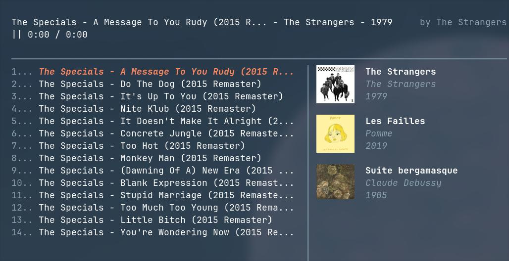

## Soli

Hybrid music player TUI written from scratch. Uses [SDL2](https://github.com/libsdl-org/SDL/blob/SDL2/include/SDL_audio.h) for audio decoding, but no other non-standard libraries are used, everything else is written from the first principles (including terminal graphics).

Not only is it a great learning opportunity about the file system / file operations / terminal IO / OOP / multithreading / etc., it also serves as a showcase for my custom terminal graphics engine [termigine](https://github.com/randytylor69/terminal-graphics-engine).

&nbsp;

&nbsp;

## Planned Features

- [x] Play local `.wav` audio files
- [x] Pause & resume current playing song
- [x] Display current song length + progress
- [x] Display albums & cover art
- [x] Display all songs in an album
- [x] Highlighting selected elements (i.e. album / song)
- [x] Vim motion as controls
- [ ] Adding local directories as albums
- [ ] Searching YouTube results locally and download directly from the TUI
- [ ]Responsive layout
