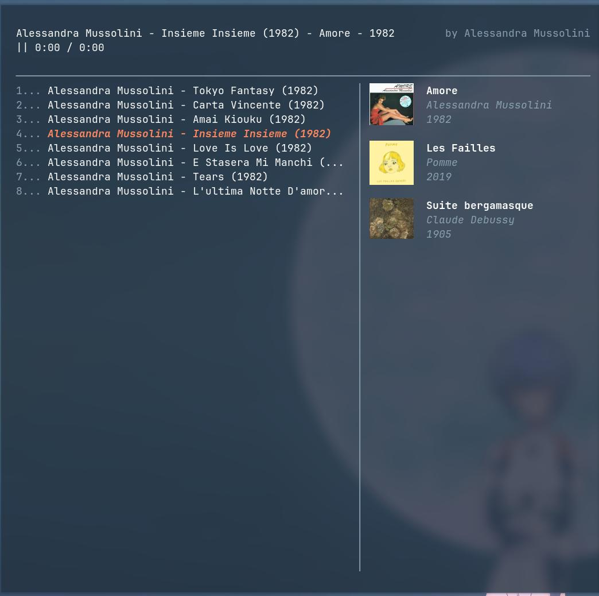

## Soli

Hybrid usic player TUI written from scratch, a showcase for my custom terminal graphics engine [termigine](https://github.com/randytylor69/terminal-graphics-engine).

| |
| --- |
| Directly `.mp3` playback inside the terminal |

&nbsp;

## Planned Features

- Listening to local audio files
- Adding directories as albums
- Searching YouTube results locally and download directly from the TUI

